# Introduction
This project is based on the existing experimental platform, namely the AWR1642 millimeter-wave radar and DCA1000EVM data capture card of Texas Instruments.  
The objectives is as follows,
* Set up the experimental environment and obtain good radar echo data.
* Process the echo signal and extract its time-domain, frequency-domain and time-frequency characteristics.
* Based on the extracted image features, key characteristics of the unmanned aerial vehicle, including distance, azimuth angle, blade length, and rotation period are systematically identified and computed.
* The experimental data should be verified based on multiple methods.

Only **part of the project** — specifically what I've worked on — are showcased in this repository.  

The approaches applied in this project are **not yet fully developed**. This repository mainly serves as a record and a possible reference approach.  

Discussions are welcome.

# 1 Experimental Tools
We chose the AWR1642BOOST mmWave Radar Sensor together with the DCA1000EVM Data-Capture Adapter for this project. These two devices work in tandem to achieve the experimental objectives: transmitting and receiving radar echoes, capturing signals, and generating binary files. 

## 1.1 the AWR1642BOOST mmWave Radar Sensor

*the AWR1642BOOST mmWave Radar Sensor*

Functional block diagram of AWR1642BOOST is a baisc thing you need to know in the project.
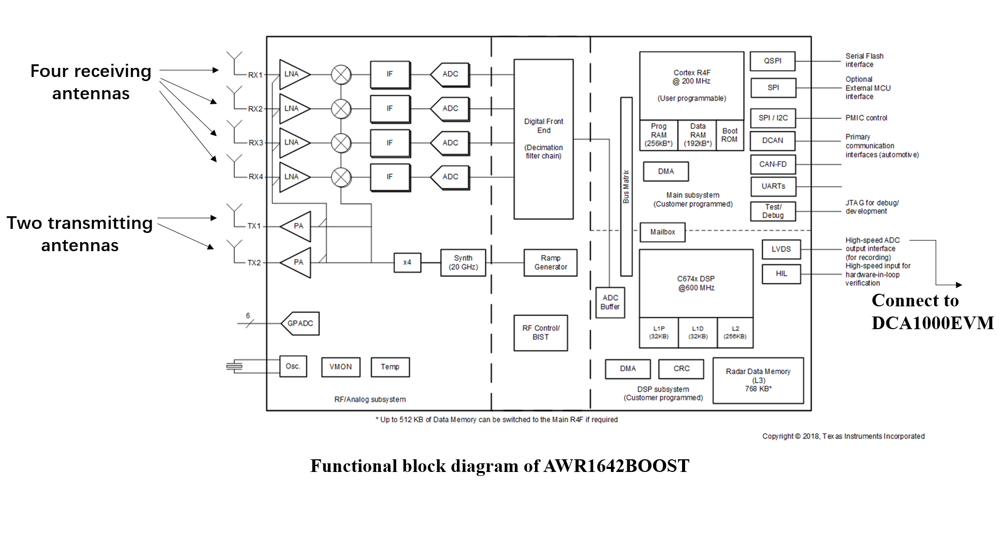

## 1.2 the DCA1000EVM Data-Capture Adapter

*the DCA1000EVM Data-Capture Adapter*
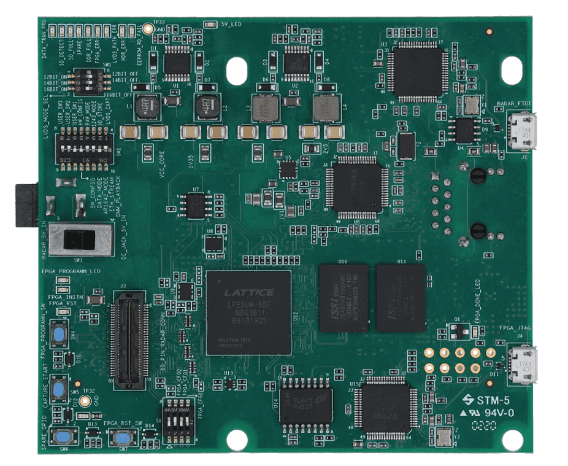

# 2 Experimental Setup
Essential preparation before the experiment.

## 2.1 Board to board connection
A simple instruction to connect the Experimental instruments.
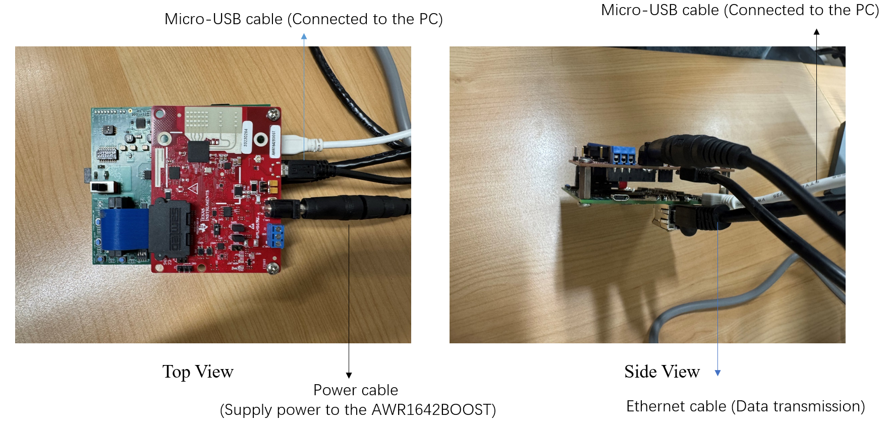

## 2.2 MMWAVE-STUDIO
MMWAVE-STUDIO is a software officially provided by Texas Instruments. It is a stand-alone Windows application that provides the ability to configure and control mmWave sensor modules and collect analog-to-digital (ADC) data for offline analysis.   
It provides a rich GUI interface, facilitating researchers to quickly debug it. And it supports multiple boards including DCA1000EVM and AWR1642BOOST.  

## 2.3 Interface of Sensor Configuration of MMWAVE-STUDIO

*Interface of Sensor Configuration of MMWAVE-STUDIO*
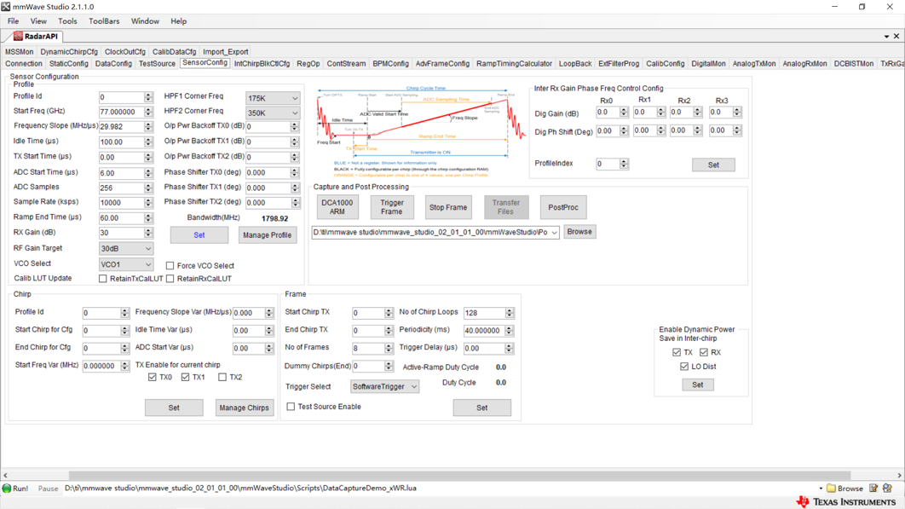

You can do direct modification of configuration parameters based on your project objectives and target.

# 3 Related_defination
Two related definitions, namely the Doppler Effect and micro-Doppler.  
If you want to know more about the details or the inference process, please check the [Reference](#Reference).

## 3.1 Doppler Effect
The Doppler effect refers to the phenomenon that the frequency of the observed wave changes when there is relative motion between the source and the observer. This phenomenon applies to sound waves, light waves, electromagnetic waves and other types of fluctuations.

Consider the scene below. Suppose that the wave has a velocity of v and a frequency of 𝑓_0, the velocity of the wave source is 𝑣_𝑠. The movement of the wave source causes the wavelength to shorten or lengthen, which affects the received frequency.
For the right observer, the source is close, and the frequency becomes  
𝑓= (𝑣/(𝑣−𝑣_𝑠 )) 𝑓_0  
For the left observer, the source is far away, and the frequency becomes  
𝑓= (𝑣/(𝑣+𝑣_𝑠 )) 𝑓_0

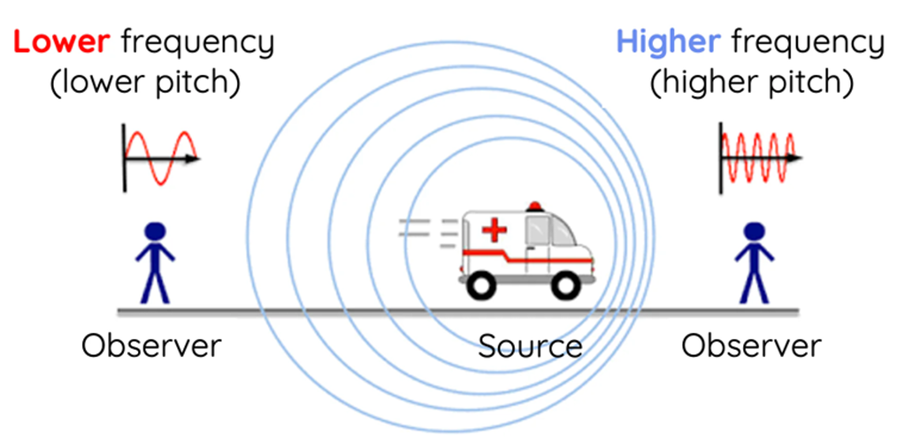

## 3.2 Micro-Doppler
**Basic concept**
* Micro-Doppler is an extension of the Doppler effect, created by small movements (such as rotation, vibration, and wobble) of the target.
* This effect superimposes additional frequency components on the Doppler spectrum to form a characteristic signal.

**Difference from Classical Doppler**
*  Classic Doppler: Frequency shift caused by the overall movement of the target.
*  Micro-Doppler: Additional frequency shift caused by local movement of the target (e.g. limb swing, rotor rotation).

# 4 Basic_Measurement_Theory
We have a few objectives to cover in the project, which are realized by a technical approach consisting of several techniques-range measurement, angle measurement, STFT and time-frequency distribution fitting.   
If you want to know more about the details or the inference process, please check the [Reference](#Reference).  
The proficiency and accuracy of this technical approach in wider scenarios or with different targets have **not been fully evaluated**.

## 4.1 Range measurement
It is well-known that an FMCW radar transmits a sequence of chirp signals (called a frame) and then mixes the receive echo with the local reference (transmitted signal) to yield a resulting beat signal at a frequency in the intermediate frequency (IF) band.    

The frequency is :𝑓_𝑏=(𝑆∗𝑑)/𝑐  
where S is the slope of chirp signal, d is the distance to the object, and c is speed of light.

## 4.2 Angle measurement
Angle estimation is conducted via processing the signal at a received phased array composed of multiple elements.  
By consulting the literature, there are several ways to do this part, such as FFT Algorithm, Multiple Signal Classification (MUSIC) Algorithm and so on. We choose to use FFT Algorithm.  

When the target is located far enough, and assuming an azimuth angle of θ, the phase difference between two adjacent receiving antennas can be expressed as  

𝛥𝜑 =(2𝜋ℎ sin⁡(𝜃))/𝜆  
where h is the separation between receive antenna pair.  

Based on this, a fast Fourier transform (Angle FFT) is applied along the receiving antenna dimension (spatial domain), thereby enabling differentiation among various targets according to the incident angle of the target signal in the azimuth direction. The angular resolution derived from the FFT is typically expressed as  

𝜃_𝑟𝑒𝑠=𝜆/(𝑁_𝑅𝑋∗ ℎ ∗cos⁡(𝜃) )  
where 𝑁_𝑅𝑋 is the number of receive antennas.

## 4.3 STFT(Short-Time Fourier Transform)
The expression of STFT is:
𝑓(𝑡, 𝑓)= ∫_(𝜏=−∞)^(+∞)▒𝑥(𝜏) ∗ℎ(𝑡−𝜏)∗exp⁡(−𝑗∗2𝜋∗𝑓∗𝜏)𝑑𝜏

The basic idea is to use a narrow time-window function 𝒉(𝒕) to capture a short segment of the signal and smooth it within that interval. Then, a Fourier transform is applied to this windowed signal to extract its frequency components, effectively filtering out signals outside the window. As the window slides over time, we obtain a two-dimensional time-frequency distribution that reveals the signal's spectral characteristics across different time periods.

The STFT algorithm is easy to use and is suitable for the analysis of micro-Doppler phenomena. We use STFT to do time–frequency analysis in our work.

## 4.4 Time-frequency distribution fitting
According to the references, a robust fitting algorithm is the fitting algorithm based on time–frequency distribution is applied to extract micro-Doppler features. After obtaining the parameters , we need to put them into the model of the Rotating Target Echo to extract the Physical characteristics(blade length and the rotor speed)

## 4.5 The model of the Rotating Target Echo
Consider the model below.

The frequency-domain features of the rotating propeller are represented by the Doppler frequency shift, and the instantaneous Doppler frequency shift generated by the blade tip rotation of the blade k is expressed as follows:

𝑓_𝐷𝑘(𝑡) = (1/2𝜋)∗((𝑑𝜑_𝑘(𝑡) )/𝑑𝑡)= −(2𝛺/𝜆)∗cos⁡(𝛽)∗sin⁡(𝛺∗𝑡)∗cos⁡(𝜑_0+(2𝜋∗𝑘)/𝑁)−cos⁡(𝛺∗𝑡)∗sin⁡(𝜑_0+(2𝜋∗𝑘)/𝑁),  (𝑘=0,1,2,…,𝑁−1)

It can be seen that the rotational speed modulates the instantaneous Doppler frequency as a sinusoidal curve, and the maximum Doppler frequency shift of the rotating blade is obtained at the tip of it, as follows:  

𝑓_𝐷𝑚𝑎𝑥=(2∗𝛺∗𝑙_𝑝)/𝜆  
Where 𝛺 is the angular velocity, 𝑙_𝑝 is the blade length

So if we have the estimated value of the maximum Doppler frequency shifts obtained by the fitting curves, the blade length can be calculated.

# 5 Outcomes

## 5.1 Targets used in the experiment

We have two targets used in the experiment:

*two-bladed helicopter rotor model*

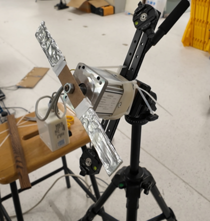

*eight-bladed UAV*

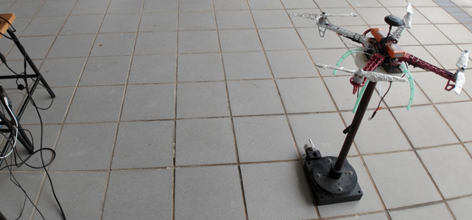

## 5.2 Radar imaging(DA heatmap)
The example of implementation of the process of  in matlab.

We present two examples of DA heatmap which illustrate distance and angle.

*DA heatmap of two-bladed helicopter rotor model*

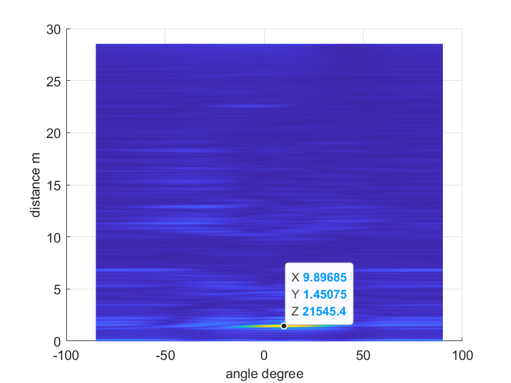

This figure illustrates the position (1.45m, 9°) of a two-bladed helicopter rotor model at one time slot. 

*DA heatmap of an eight-bladed UAV*

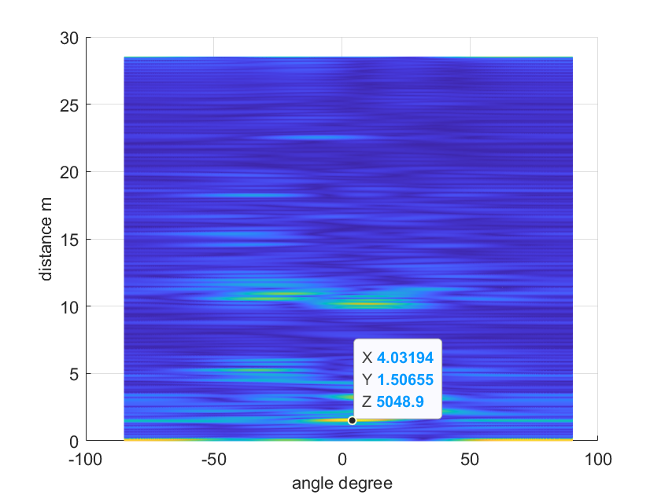

This figure illustrates the position (1.50m, 4.7°) of an eight-bladed UAV at one time slot.

## 5.3 Radar imaging(STFT heatmap)
In the project, we tested two targets at three different tilt angles — 30°, 60°, and 80°. For each angle, experiments were conducted at three different rotational speeds: 200 rpm, 600 rpm, and 1000 rpm.  

We have employed a series of signal processing techniques to achieve an optimal performance, including TDM-MIMO separation, CFAR detection, Doppler compensation, angle estimation and clustering, as well as radar cube cropping. 

We present a series example of STFT heatmap of two-bladed helicopter rotor model with 200 rpm and different degrees.

The example of implementation of the whole process of  in matlab.

*two blades, 0°, 200 rpm micro-Doppler map*

*two blades, 30°, 200 rpm micro-Doppler map*

*two blades, 60°, 200 rpm micro-Doppler map*

Under identical angular conditions, we observed that higher rotational speeds result in denser curves with more pronounced fluctuations.

From the result of experiment, we found that STFT image of the quadrotor exhibited denser features than that of a single-rotor system. Different numbers of rotors have a big effect on the STFT heatmap.

## 5.4 the fitting curve
We use python to do the process of 

To show the process of using Time–Frequency Distribution fitting algorithm, we use a two-bladed helicopter rotor model, where the angle between the rotor and the ground is 30 degrees and the rotation speed is 200 rpm as an example:

*Original_grayscale_image*

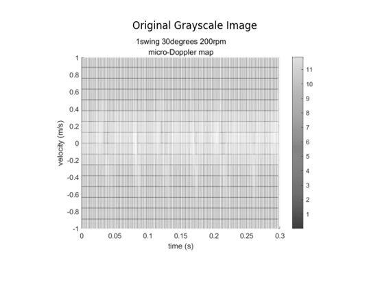

*Binarized_image*

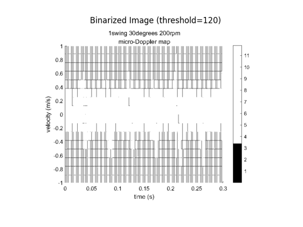

*Scaled_Discrete_Data*

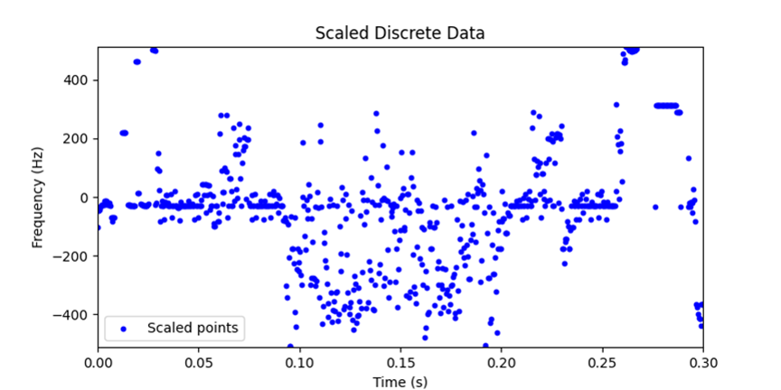

When the rotor speed is 200rpm(In practical experiments, the value tends to fluctuate to approximately 235), the fitting curve is:  
𝑓(𝑡) = 146.938∗𝑠𝑖𝑛(26.097∗𝑡−5.387)−61.127

*Sine curve fit result of discrete time-frequency curve*

Therefore, the rotational speed is 249.20 rpm, the relative error is 6.38%. The estimated average maximal Doppler frequency shift is 146.93 Hz, the blade length can be calculated to be 0.069 m, the relative error is 65.1%. A significant error exists.

In summary,

We can obtain the distance and the azimuth angle information from the RA heatmap.

We can compute the rotational speed and the blade length through the fitting curve

# Reference
[1] He, Binyu. "Research on UAV Target Micro-Doppler Spectrogram Recognition
Based on Deep Learning" [D]. University of Electronic Science and Technology of
China, 2023.  
[2] Gong, Ting. "Research on Radar Target Micro-Motion Parameter Estimation and
Micro-Motion Form Classification Technology" [D]. National University of Defense
Technology, 2020.  
[3] Qin X, Deng B, Wang H. Micro-Doppler Feature Extraction of Rotating
Structures of Aircraft Targets with Terahertz Radar[J]. Remote Sens, 2022, 14:3856.
https://doi.org/10.3390/rs14163856  
[4] Gao X, Xing G, Roy S, Liu H. Experiments with mmWave Automotive Radar
Test-bed[R]. University of Washington, [n.d.].Available from : https
//github.com/Xiangyu-Gao/mmWave-radar-signal-processing-and-microDopplerclassification  
[5] Ma J, Dong Y W, Li Y, et al. Multi-rotor UAV's micro-Doppler characteristic
analysis and feature extraction. Journal of University of Chinese Academy of
Sciences, 2019, 36(2): 235-243.  
[6] Chen, Yongbin, Li, Shaodong, Chen, Wenfeng, et al. "Modeling and
Characteristic Analysis of Helicopter Rotor Blade Echoes" [J]. Journal of the Air
Force Early Warning Academy, 2015, 29(05): 322-327.  
[7] Mmwave Radar Device ADC Raw Data Capture,Ti

